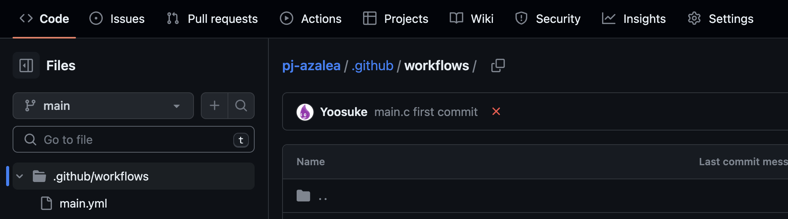
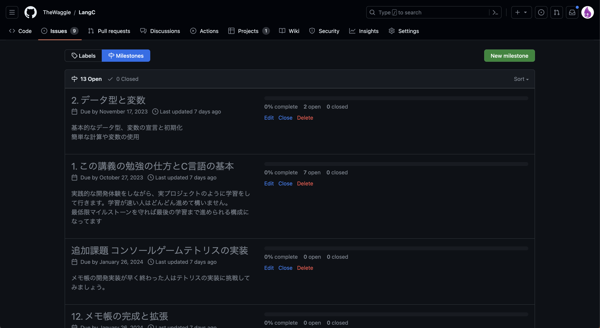
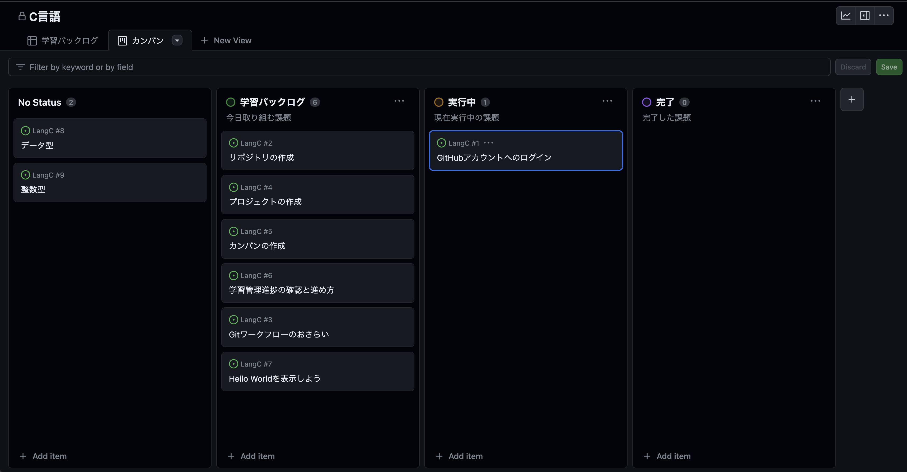
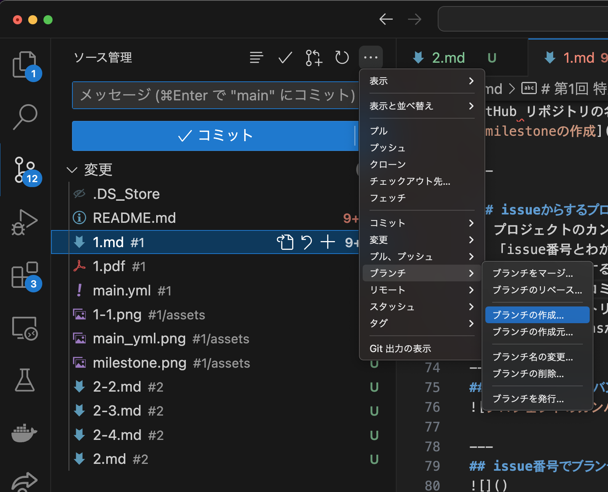
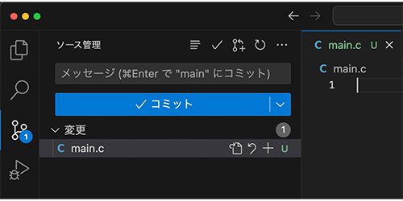
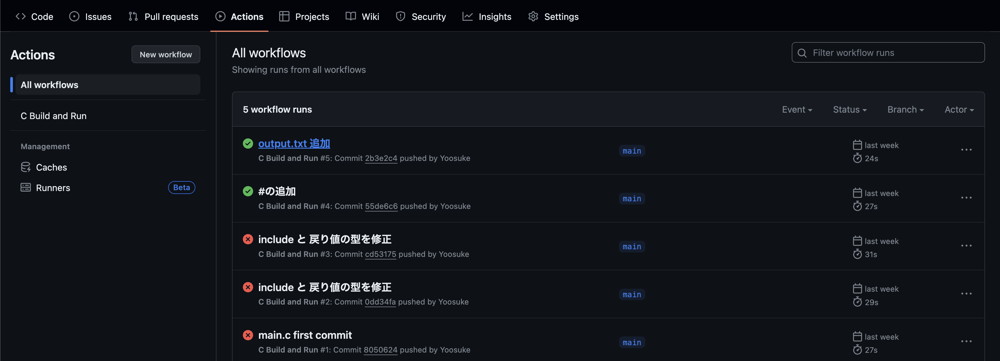

# 第1回 特別講義
10/27 , 中尾 瑛佑 , 鈴木 康平

---

## 全12回の講義のゴール
* 実際のプロジェクトと同じような（簡易版）体験と共にC言語の開発の基礎を身につける
* C言語を使って、仕様書をもとに実践的な開発オペレーションにてプログラムを作る事ができる能力を身につける
  * 簡単なCLIのメモ帳の作成

---

## この授業で利用するツール
* [GitHub](https://github.com/)
* [Visual Studio Code](https://code.visualstudio.com/?wt.mc_id=vscom_downloads)

---

## 今回の講義のゴール
* GitHubワークフローに則った開発を理解する
* カンバン方式での学習管理をする
* c言語で Hello World! を表示する

---

## この講義資料
* [この講義資料のリポジトリ](https://github.com/TheWaggle/LangC)

---

## なぜこのような形式をとるのか？
* プログラミングだけを学んでもチーム開発でどのように連携を取って開発を進めれば良いかわからないと実践で苦労する
* プログラミング言語を学ぶことが「あいうえお」などを学ぶ事と同義として位置付けると美しい字を書くための書き順を覚える必要がある。書き順を知り、練習するからこと綺麗な字が書けるのと同じでトレーニングが必要

---

## C言語環境構築
### gitHub環境を準備
* リポジトリの準備
* リポジトリをクローンする
* リポジトリに「.github/workflows/main.yml」を準備する
  * .github/workflows/ フォルダを作成する
  * main.ymlは配布します。
* プロジェクトを作成しよう。

---
## .github/workflows/main.yml 

---

## アジャイル開発の流れと同じプロセスで学習を管理します。
### 初回セットアップ（プロジェクトの準備）
1. 最初に学習バックログを作成する
2. milestoneを作成する
3. ラベルを作成する
4. issueを作成し、milestoneをissueに追加します
5. github リポジトリをローカル環境（自分のPC）にcloneする

---

## milestoneの作成
GitHub リポジトリの名前は[LangC]としてください。

---

### issueからするプログラミングの流れ
1. プロジェクトのカンバンから学習するissueを実行中に移動する
2. 「issue番号とわかりやすい名前」(今回は #7/helloworld ）でブランチを作る
3. ブランチで作業する
4. 作業終了したらコミットする
5. リモートリポジトリ（GitHub）にプッシュする
6. GitHub Actionsが実行されているか確認する

---
## プロジェクトのカンバンから学習するissueを実行中に移動する

---
## #7/helloworldでブランチを作る
※ issue番号は自分の番号に合わせてください。

---

## ブランチで作業してコミットする

---

## GitHub Actionsが実行されているか確認する
赤は失敗
緑は成功

---

## 今日の確認テスト

[本日のテストURL](https://docs.google.com/forms/d/e/1FAIpQLSfLmwFaEj4DJy1ONe2GIIEFQoUFrQuzMsAe-RF5mobs2_SYHg/viewform?usp=sf_link)

