# 第3回 特別講義

### 本日のゴール
**C言語基礎：制御構造で簡単な計算ロジックを組めようになる**

### 本講義の進め方 - 体系的プログラミング学習
**ステップ①** 前回講義で使用したご自身のGitHubリポジトリをクローンします
**ステップ②** 本講義で取組む課題やテストを記述していくフォルダ&ファイルを作成します
**ステップ③** 資料に沿って課題やテストに取組みます
**ステップ④** 本講義終了までにご自身のGitHubリポジトリにコミット&プッシュし、本日の課題とテストの結果を成果物として提出していただきます

---

*※本講義で行う課題やテストの履歴は単位に関わる重要な評価軸になります*
*※本講義で資料で使用するソフトウェアと皆さんの実際に操作するソフトウェアでは一部見え方が異なる場合があります*
*※本講義は[こちらのサイト](https://9cguide.appspot.com/top.html)をベースに作成しています。*
*※資料の途中に参考資料が多々貼り付けてあります。各章ごとの要点がまとめられています。*

---

## GitHubリポジトリ準備

---
①VScodeを立ち上げます
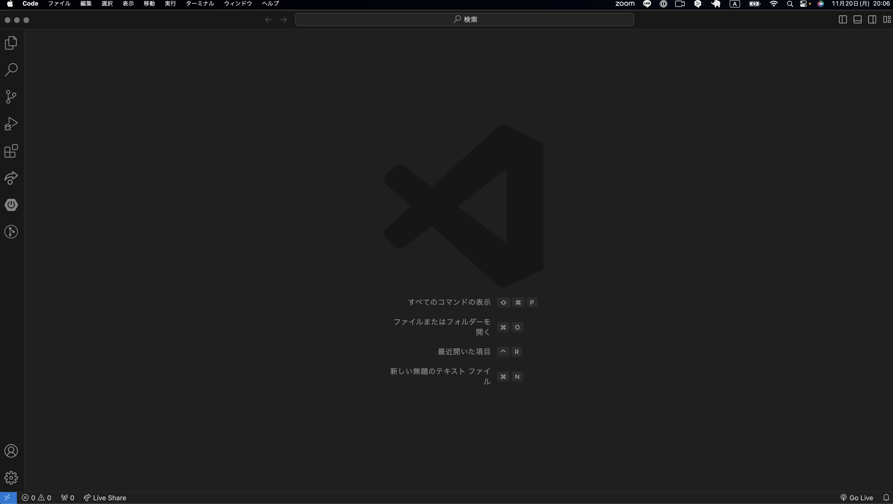

---
②上部メニューバーから『ターミナル』を選択し、<font color="red">新しいターミナル</font>を選択します
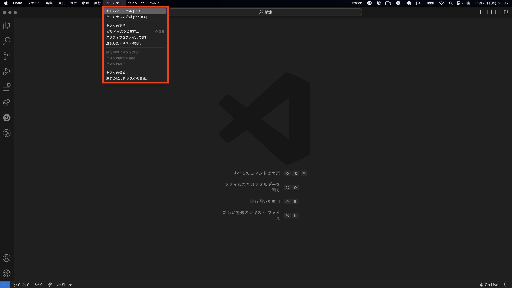

---
③VScode下部にターミナルが立ち上がることを確認してください
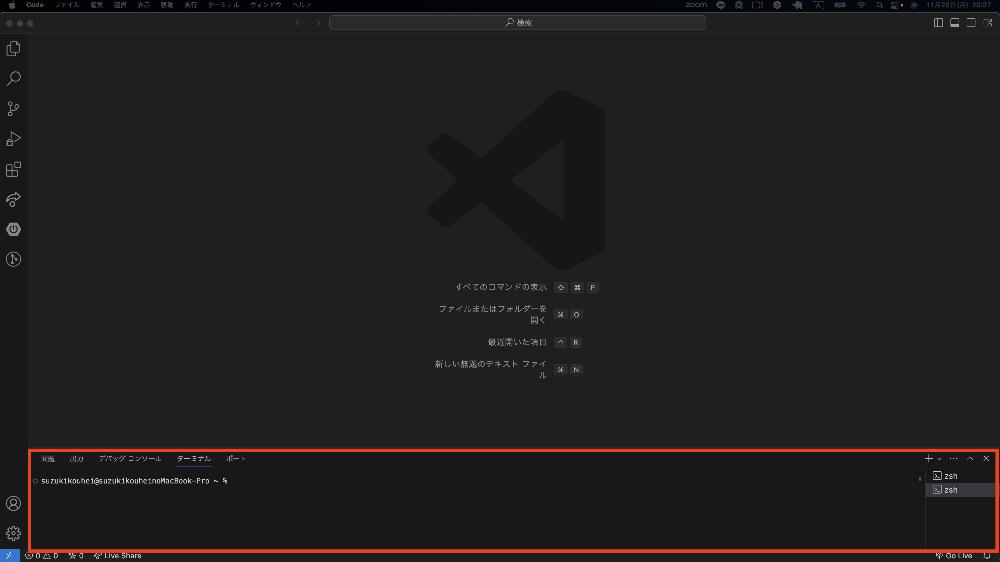

---
④C言語講義で使用するプロジェクトが保存されているご自身のディレクトリにコマンドラインで移動します。例：<font color="red">cd Document</font>と入力しEnter
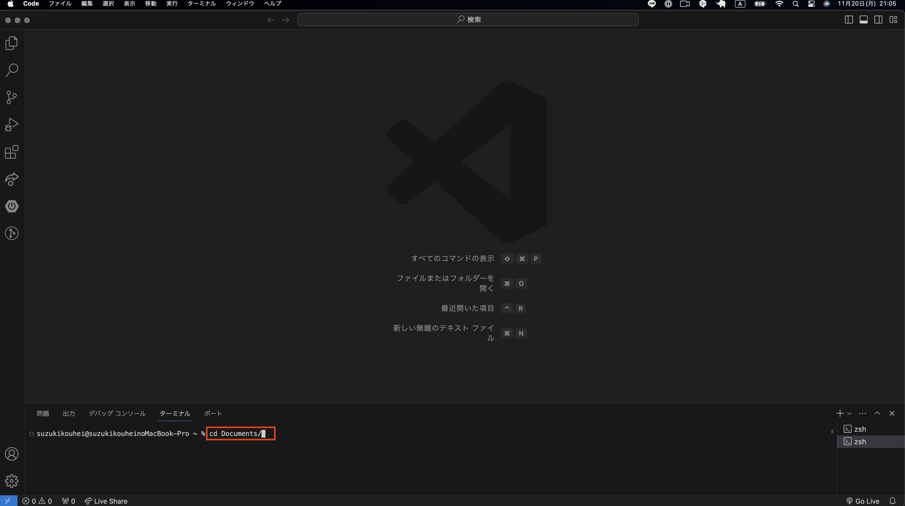

---
⑤プロジェクトが保存されている親ディレクトリ(../)で<font color="red">ls</font>と入力しEnterを押します。
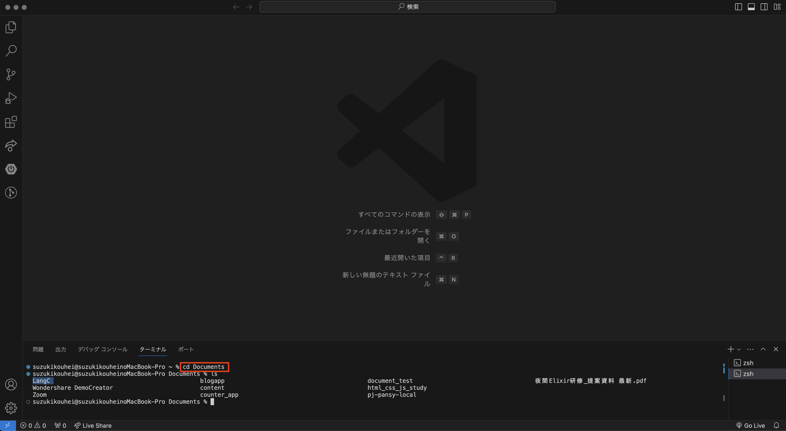

---
⑥LangC(本講義ディレクトリ名)ディレクトリに移動します。<font color="red">cd LangC</font>と入力しEnterを押します。
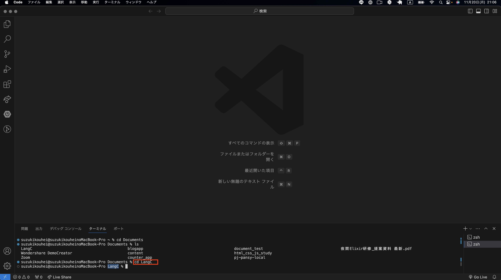

---
⑦LangCディレクトリに移動できたら<font color="red">code .</font>と入力しEnterを押します。これでLangCディレクトでVScodeを立ち上げることができます。
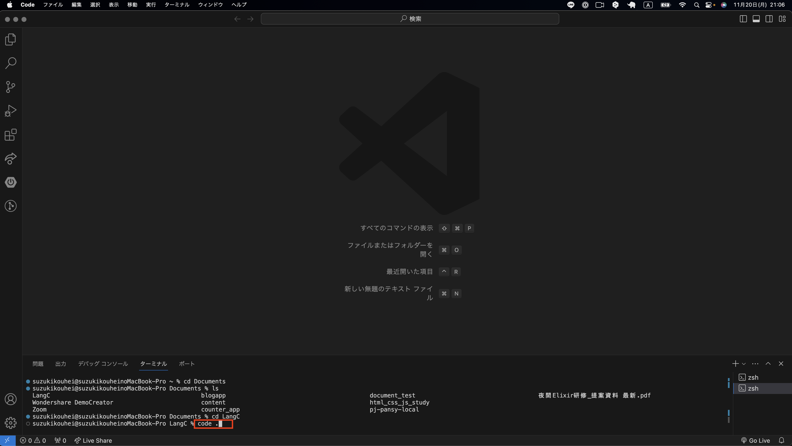

---
⑧新たにVScodeが立ち上がったら、元々操作していたVScodeは閉じましょう。
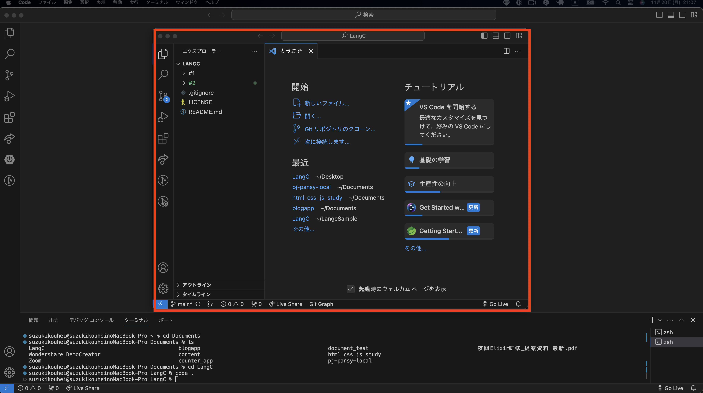

---
⑨新たにターミナルを立ち上げ、ターミナル上で<font color="red">git branch</font>と入力しEnterを押します。おそらく<font color="lime">main</font>と表示されます。

#### 補足
<font color="red">git branch</font>コマンドはGitで使用されるブランチ（プロジェクトの異なるバージョンや機能を管理するための枝分かれ）を操作するためのコマンドです。
<font color="red">git branch</font>コマンドを実行すると、リポジトリ内の全てのブランチが一覧で表示されます。
今回はbranchが<font color="lime">main</font>のみなのでそれ以外のbranchはありません。

---

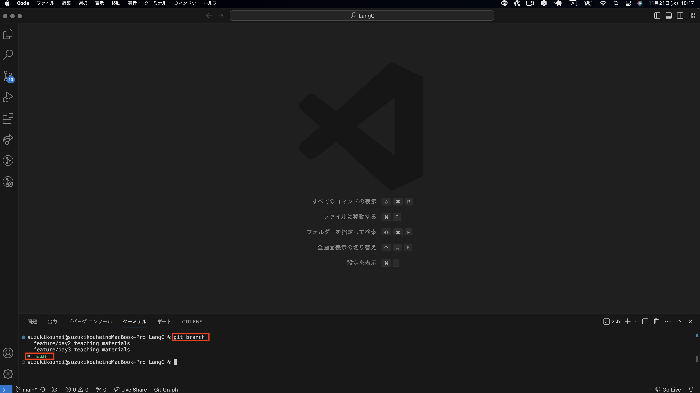

---
⑩次に、<font color="red">git pull</font>コマンドを入力しEnterを押します。
#### 補足
<font color="red">git pull</font>コマンドは、リモートリポジトリ（通常はGitHubやBitbucketなどのオンライン上のリポジトリ）から最新の変更を取得し、それを現在のローカルリポジトリ（自分のコンピュータ上のプロジェクト）に統合するために使用されるGitコマンドです。このコマンドは実質的に以下の二つの操作を一度に行います。

今回はリモートとローカルで変更がなかったため<font color="red">Already up to date.</font>（すでに最新です）と表示されました。仮に変更があった場合は、何らかの処理が表示されるものと覚えておきましょう。

---

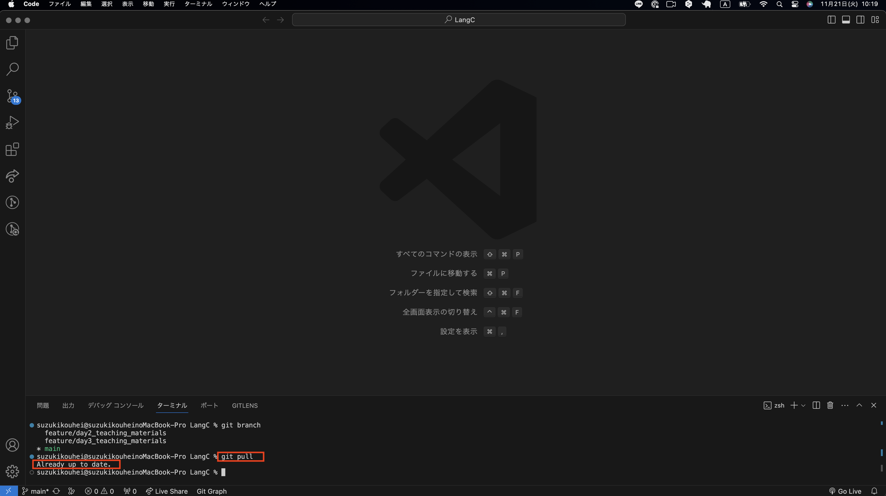

---
⑪新しいフォルダを作成しましょう。フォルダのアイコンを選択し、フォルダ名を **#3** (第3回目講義の意)としましょう。
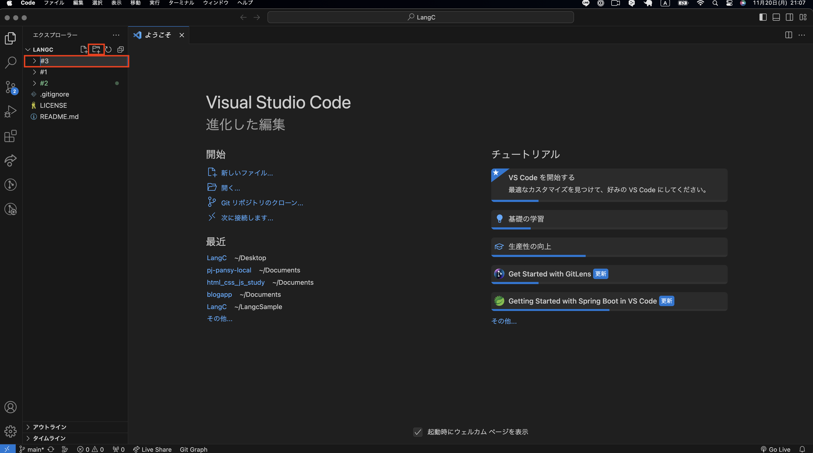

---
⑫続いて、#3フォルダ内で新しいファイルを作成しましょう。ファイル名を **c_study.c** としましょう。
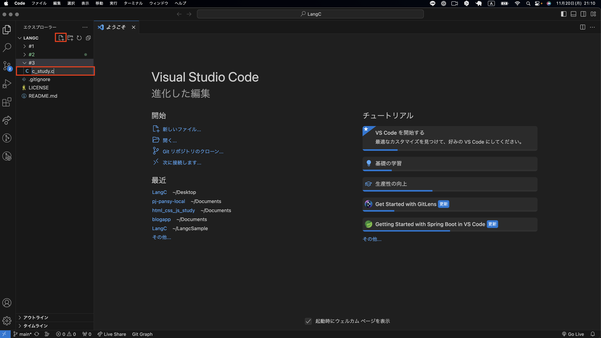

---
⑬ここまでで、GitHubリポジトリの準備が完了できました。これより、C言語学習に取組んでいただきます。
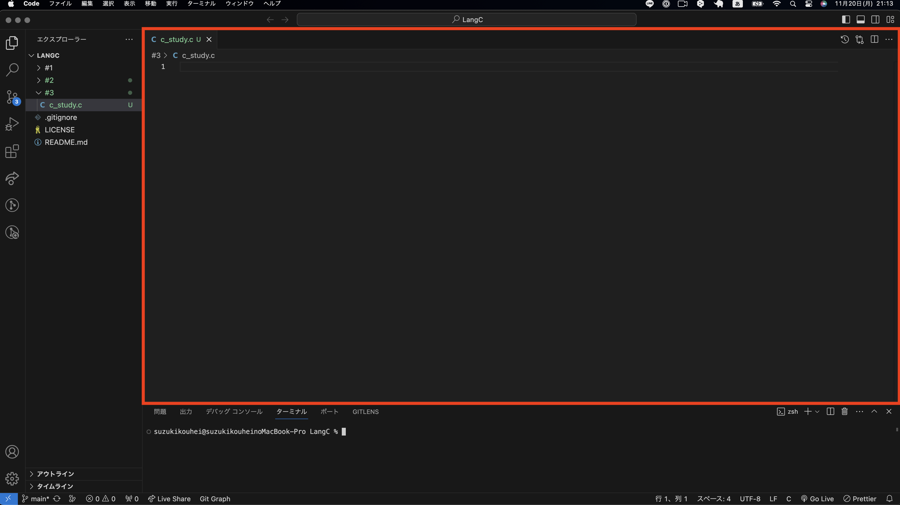

---
## 制御構造

本日はプログラミングをする上で非常に重要な制御構造について学んでいきます。

#### 制御構造とは
- プログラムの実行フロー（処理の流れ）を制御するための命令群です。
- 制御処理を行うプログラムの基本は、if文、for文、while文などが挙げられます。

**本日は、if文、for文、while文を中心に学習していきます。**

---
## if文：条件に基づいて異なる処理

---
前回の講義ではプログラムを使っての計算処理など一方通行のプログラミング処理を行いました。つまり、始めから終わりまで、書かれている順番通りに文を実行し、
文がなくなれば終わりになると言う、もっとも単純な仕組みでした。

仮に以下のような条件によって処理内容を変える場合、一方通行のプログラムだと処理ができません。
```
・お金に余裕がある ならば 焼肉定食
・お金に余裕がない ならば 素うどん
```

このような条件による判断を行うプログラムが**if**という文法になります。
それでは実際に書いていきましょう。

---
*※前回まで学習した部分でわからない箇所はしっかり復習しながら進めましょう*

---
#### if文基本文法
以下はif文の基本文法です。ifの後に、何かしらの条件を定義し、条件に当てはまれば{}内の処理を行うという処理構造です。
```
if (条件式)

{

  （条件式が成立する場合の処理を記述）

}
```

---
#### 基本課題
それでは、if文を使って変数 aが5より大きいかどうかを判定するプログラムを作成します。
int(整数型)のmain()メソッドを作成しその中に処理内容を書いていきます。
では、下記ソースコードを`c_study.c`に記述しコンパイル、実行まで行いましょう。
**記述**
```c
int main() {
    int a = 6;
    if (a > 5) {
        printf("aは5より大きい\n");
    }
    return 0;
}
```
---
**コンパイル**
- VScodeでターミナルを開き、`#3`フォルダに移動しましょう。
- 移動できたら、ターミナル上で以下を実行
`gcc c_study.c -o a`
#### 補足
前回までのコンパイルは自動で`a.out`という実行ファイルが生成されていましたが、今回から`-o`というオプションコマンドを使い、実行ファイルに名前をつけていきます。
課題ごとにコンパイルを実行するので、a~zのアルファベットをファイル名としていきます。


---
**実行**
`a`という名前のファイルが生成されたことを確認してください。
確認ができたら以下コマンドで実行します。
`./a`

#### 補足
`./`とはカレントディレクトリ（今居る場所）を表します。今回実行したい`a`というファイルは`#3`フォルダ内にあり、仮に`#3`フォルダ内から`a`ファイルを実行したい場合は`./a`となるということです。もし、ひつ上の階層、親ディレクトリにあたる`LangC`フォルダ内で`a`ファイルを実行したい場合は、`./#3/a`となります。

---
#### 一連のコンパイル、実行手順
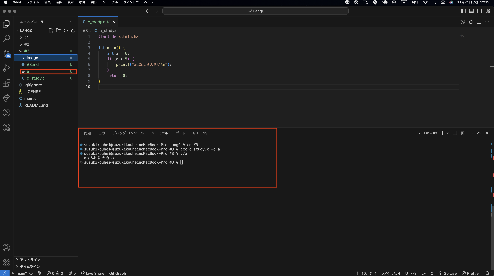

---
#### コメントアウトによる解説
```c
#include <stdio.h> // 標準入出力ライブラリのインクルード

// main関数 - プログラムのエントリーポイント
int main() {
    int a = 6; // 変数aの宣言と初期化

    // if文でaが5より大きいかをチェック
    if (a > 5) {
        // aが5より大きい場合、メッセージを表示
        printf("aは5より大きい\n");
    }

    return 0; // プログラムの終了
}
```
---
#### if文全体解説
①main関数はのプログラム開始部分です。C言語のプログラムでは、main 関数がプログラムの実行開始点となります。
②整数型 (int) の変数 a を宣言し、それに値 6 を代入しています。これは、変数 a に6という数値を格納することを意味します。
③if 文を使用して、変数 a の値が5より大きいかどうかを判定しています。この条件が真（つまり a が5より大きい場合）、if 文の中のブロック（{} 内）が実行されます。
④printf 関数を使って、文字列 "aは5より大きい" と改行文字 \n をコンソールに出力します。この行は、if 文の条件が真の場合にのみ実行されます。main 関数の終わりです。⑤return 0; は、プログラムが正常に終了したことをオペレーティングシステムに通知します。0 は、成功を表す標準的なコードです。

---
### アドバイス①
if文だけでなく、この後学ぶfor文やwhile文ではよく比較演算子というものを用います。日常でも算術演算子+-×÷などは使うかと思いますが、左右の値を比較するために比較演算子という演算子を使うので基本的なものは覚えておきましょう。
比較演算子がわからない場合は、**比較演算子 一覧**などで検索すると良いでしょう。
**基本的な演算子一覧**
```c
expr1 == expr2		// 比較演算：expr1とexpr2が等しければ
expr1 != expr2		// 比較演算：expr1とexpr2が等しくなければ
expr1 < expr2		// 比較演算：expr1がexpr2より大きければ
expr1 <= expr2		// 比較演算：expr1がexpr2以上であれば
expr1 >= expr2		// 比較演算：expr1がexpr2以下であれば
expr1 > expr2		// 比較演算：expr1がexpr2より小さければ
```
---
### アドバイス②
プログラミングは一つ一つのロジック、処理の流れを１つずつ追うことがプログラムを読み解くコツです。全体で見渡してしまうと、とても複雑に感じてしまいます。

例えば、先ほどのif文も` if (a > 5) {printf("aは5より大きい\n");}`もif(もしも)、(a > 5)aが5より大きければ、`{}`の処理を行う。`{}`内の処理はprintf関数を使用し「aは5より大きい」と画面に出力する。と言うように読み解くことができます。

プログラムは全体を見渡すのではなく、一つずつ読み解き全体の流れを把握するということを覚えておきましょう。

---
### チャレンジ問題①
- c_study02.cファイルを新たに作成してください
`#3/c_study02.c`

コンパイル、実行まで行い実行結果を確かめてください。

---
### チャレンジ問題②
- c_study03.cファイルを新たに作成してください
`#3/c_study02.c`

コンパイル、実行まで行い実行結果を確かめてください。

---

---
## forループ： 決められた回数だけ繰り返す処理

---
#### for文基本文法
以下はfor文の基本文法です。for 文は一定の回数繰り返しを行う場合に使用します。 for 文の書式は次のようになっています。
```
for (初期化;条件式;変化式)
  実行する処理;
```

---
#### 基本課題
それでは、for文を使って1から5までの数字を順番に出力するプログラムを作成しましょう。
int(整数型)のmain()メソッドを作成しその中に処理内容を書いていきます。
では、下記ソースコードを`c_study04.c`に記述しコンパイル、実行まで行いましょう。
**記述**
```c
#include <stdio.h> // 標準入出力ライブラリのインクルード

// main関数 - プログラムのエントリーポイント
int main() {
    // for文を使用して1から5まで繰り返し
    for (int i = 1; i <= 5; i++) {
        // 現在のiの値を出力
        printf("%d\n", i);
    }

    return 0; // プログラムの終了
}
```
---
**コンパイル**
- VScodeでターミナルを開き、`#3`フォルダに移動しましょう。
- 移動できたら、ターミナル上で以下を実行
`gcc c_study04.c -o d`

---
**実行**
`d`という名前のファイルが生成されたことを確認してください。
確認ができたら以下コマンドで実行します。
`./d`

---
#### 一連のコンパイル、実行手順
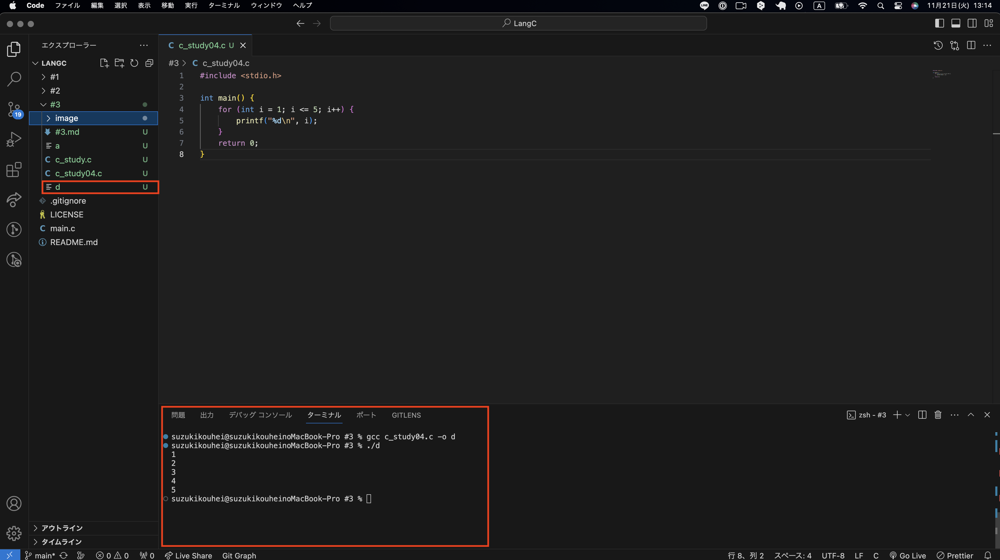

---
#### コメントアウトによる解説
```c
#include <stdio.h> // 標準入出力ライブラリのインクルード

// main関数 - プログラムのエントリーポイント
int main() {
    int a = 6; // 変数aの宣言と初期化

    // if文でaが5より大きいかをチェック
    if (a > 5) {
        // aが5より大きい場合、メッセージを表示
        printf("aは5より大きい\n");
    }

    return 0; // プログラムの終了
}
```
---
#### for文課題解説
for文は、初期化 (int i = 1)、条件 (i <= 5)、イテレーション (i++) の3部分で構成されており、これらの部分がループの動作を制御します。
```c
    // for文を使用して1から5まで繰り返し
    for (int i = 1; i <= 5; i++) 
```
①int i = 1 はループカウンタの初期化で、i という変数に1を代入しています。
②i <= 5はループの条件で、i の値が5以下である限りループを続けることを意味します。
③i++ はループの各反復後に実行される操作で、カウンタ i を1増やします。

よって、実行結果は1から5までの数値を順に出力します。

---
### チャレンジ問題①
**変数 x が10より大きい場合に「xは10より大きい」と出力するプログラムを書いてください。**
- c_study02.cファイルを新たに作成し、`c_study02.c`ファイル内にソースコードを記述してください。
`#3/c_study02.c`

コンパイル、実行まで行い実行結果を確かめてください。

---
### チャレンジ問題②
- c_study03.cファイルを新たに作成し、`c_study03.c`ファイル内にソースコードを記述してください。
`#3/c_study02.c`

コンパイル、実行まで行い実行結果を確かめてください。

---
## while文：条件が満たされている間、繰り返します。

---
#### while文基本文法
以下はwhile文の基本文法です。while文は指定された条件が真（true）である間、繰り返し特定の処理を行う制御構造です。while文の書式は次のようになっています。
```
while(条件式) {
    処理
}
```
---
#### 基本課題
それでは、while文を使ってwhile文を使って5回「Hello, world!」と出力するプログラムを作成しましょう。
int(整数型)のmain()メソッドを作成しその中に処理内容を書いていきます。
では、下記ソースコードを`c_study07.c`に記述しコンパイル、実行まで行いましょう。
**記述**
```c
#include <stdio.h>

int main() {
    int count = 0;
    while (count < 5) {
        printf("Hello, world!\n");
        count++;
    }
    return 0;
}
```
---
**コンパイル**
- VScodeでターミナルを開き、`#3`フォルダに移動しましょう。
- 移動できたら、ターミナル上で以下を実行
`gcc c_study07.c -o g`

---
**実行**
`g`という名前のファイルが生成されたことを確認してください。
確認ができたら以下コマンドで実行します。
`./g`

---
#### 一連のコンパイル、実行手順
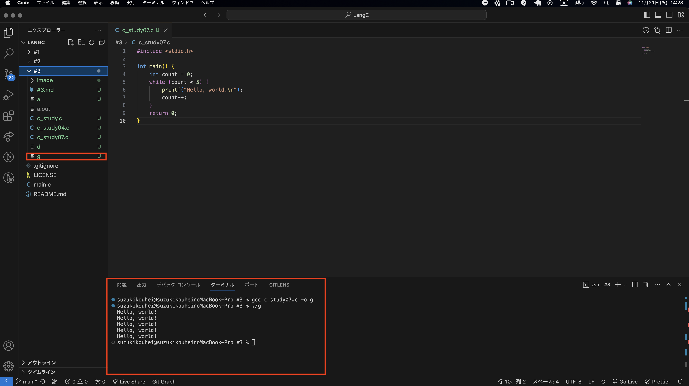

---
#### コメントアウトによる解説
```c
#include <stdio.h> // 標準入出力ライブラリのインクルード

// main関数 - プログラムのエントリーポイント
int main() {
    int count = 0; // カウンターの初期化
    // while文で条件が満たされる間繰り返し
    while (count < 5) {
        // メッセージを出力
        printf("Hello, world!\n");
        count++; // カウンターを増やす
    }

    return 0; // プログラムの終了
}
```
---
#### while文課題解説
```c
  while (count < 5)
```
①whileループはcountが5未満の間、ループ内の処理を繰り返します。条件が偽（count が5以上）になると、ループは終了します。

---
### チャレンジ問題①
- c_study08.cファイルを新たに作成し、`c_study08.c`ファイル内にソースコードを記述してください。
`#3/c_study08.c`

コンパイル、実行まで行い実行結果を確かめてください。

---
### チャレンジ問題②
- c_study09.cファイルを新たに作成し、、`c_study09.c`ファイル内にソースコードを記述してください。
`#3/c_study09.c`

コンパイル、実行まで行い実行結果を確かめてください。

---
## 複合課題

---
## 総合テスト

---
